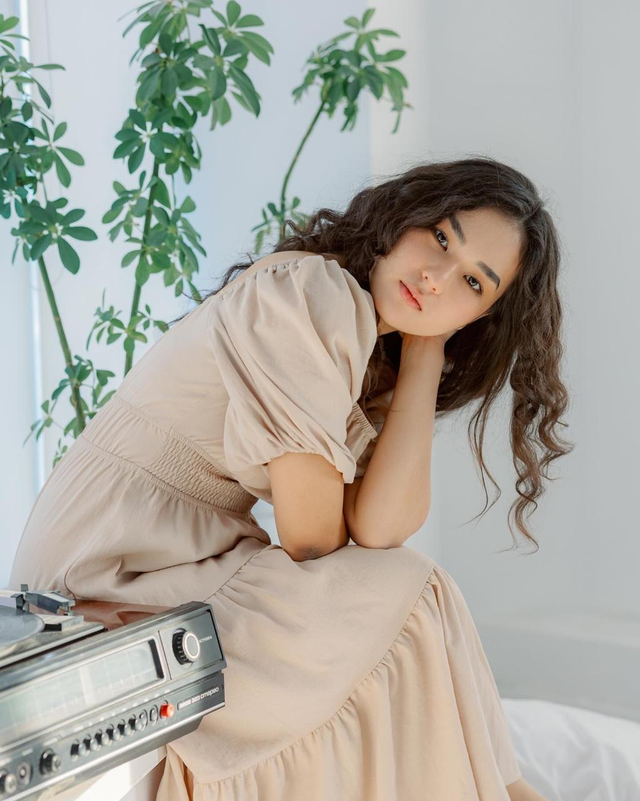
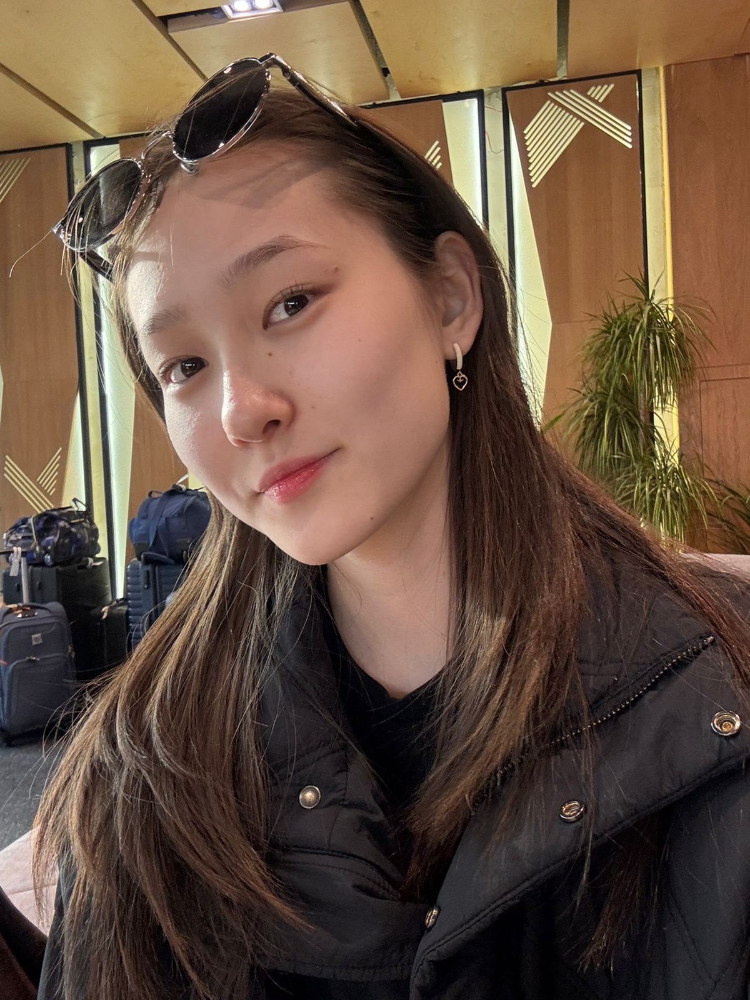

# ZHANYM
This repository showcases the journey and development of our robot created for the **2025 World Robot Olympiad – Future Engineers** category.

We are **Team Zhanym WRO2025**, a duo of passionate and driven girls who designed, engineered, and built this robot from the ground up.

Here, you'll find all the documentation, design insights, and technical details behind our project.

# Hello! 👋

My name is **Aigerim**, and I am **17 years old**.

This is my **second adventure** in the **WRO (World Robot Olympiad)** — a journey that fuels my passion for innovation and technology.

My first experience was back in **Grade 9**, when I took on the challenge of the **RoboMission category (Senior Division)**.  
That experience sparked my love for robotics and teamwork.

Now, I'm excited to take things to the next level as I dive into the **Future Engineers** category — where creativity, design, and real-world engineering come together! 🚀
.

# Hi! 👋

I’m **Zhanuya**, a **16-year-old student** passionate about **engineering**, **coding**, and **hands-on problem solving**.

I love working on tech projects that combine **hardware and creativity**.

Last year, I competed in the **WRO Future Engineers** category,  
and I’m excited to keep learning and building in this category! 🚀

## 👨‍🏫 Mentor: Askar

Hello! My name is **Askar**, and I am the **mentor** of this amazing team.

I’m truly happy to work with such talented and motivated students who are passionate about engineering, creativity, and robotics.

Guiding them through challenges and helping them grow is a privilege and a joy.

I also work at **Nazarbayev Intellectual School (NIS)** in **Atyrau**, where I support young minds in exploring STEM fields and developing real-world problem-solving skills.

