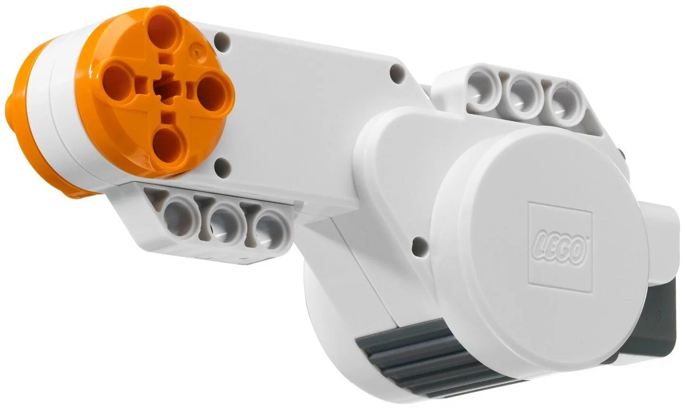
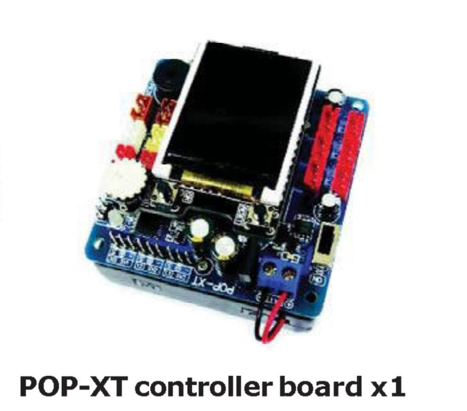
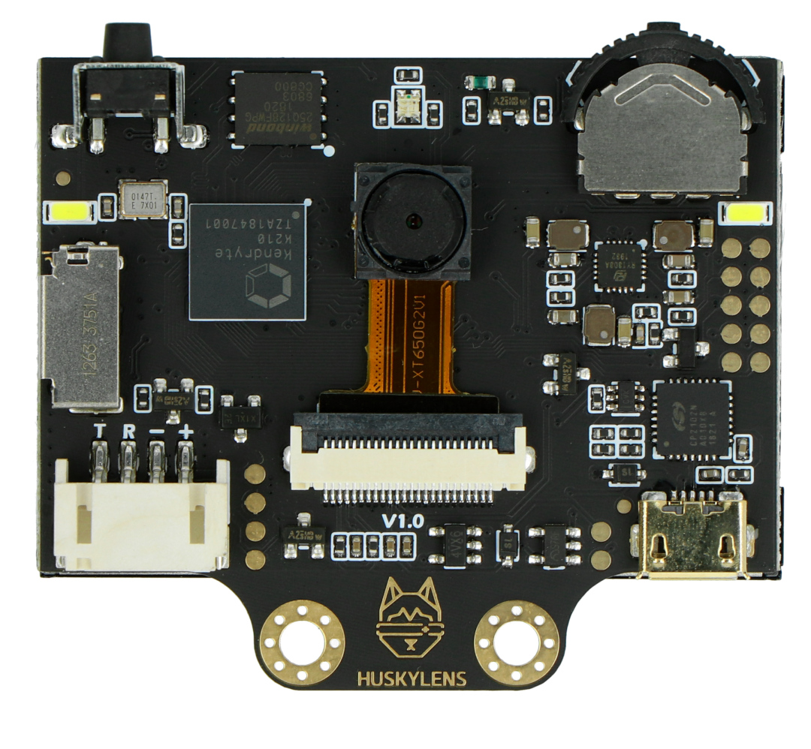
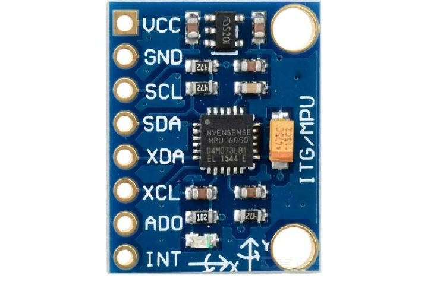
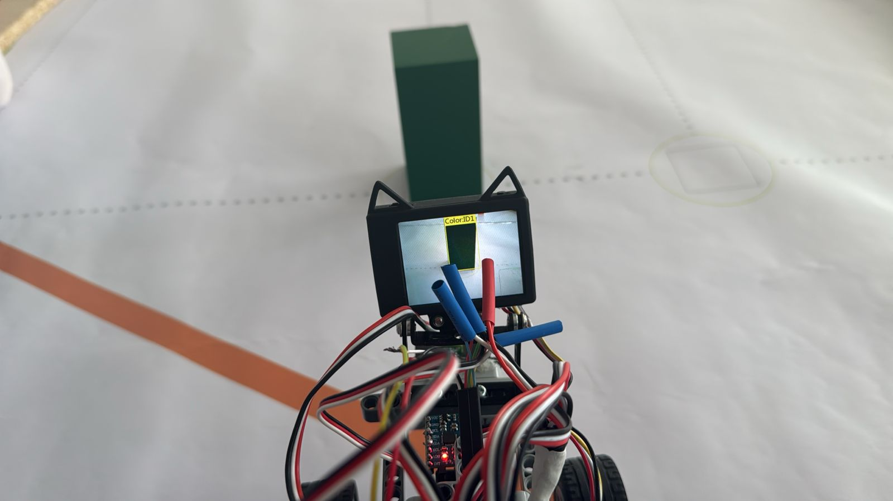
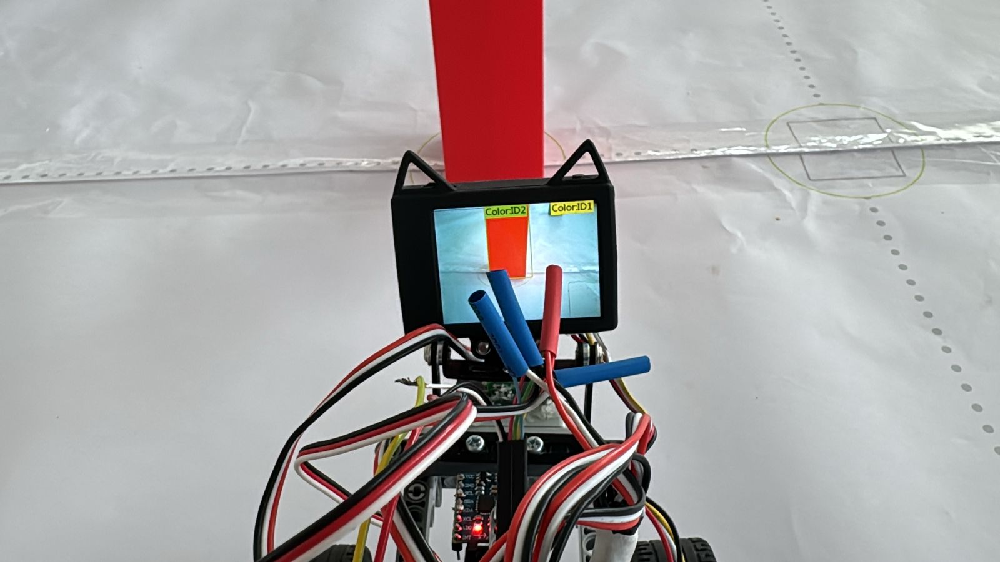
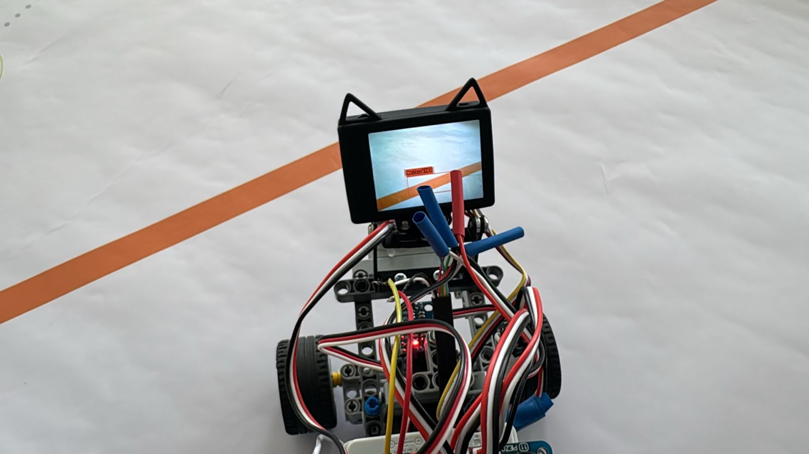
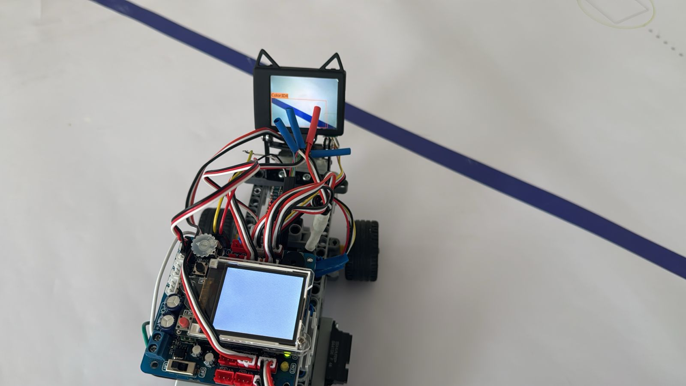
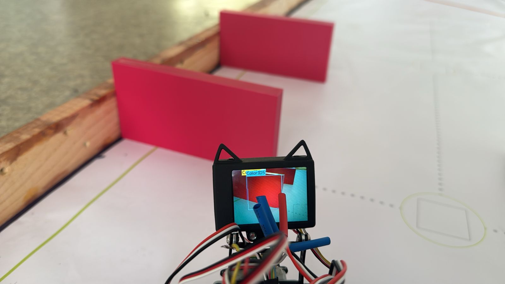

# <h1 align="center"> ZHANYM </h1> 

This repository showcases the journey and development of our robot created for the **2025 World Robot Olympiad – Future Engineers** category.

We are **Team Zhanym WRO2025**, a duo of passionate and driven girls who designed, engineered, and built this robot from the ground up.

Here, you'll find all the documentation, design insights, and technical details behind our project.

<p align="center">
  
</p>


## Team Members 
### Khanbay Aigerim
Hello! 👋

My name is **Aigerim**, and I am **17 years old**.

This is my **second adventure** in the **WRO (World Robot Olympiad)** — a journey that fuels my passion for innovation and technology.

My first experience was back in **Grade 9**, when I took on the challenge of the **RoboMission category (Senior Division)**.  
That experience sparked my love for robotics and teamwork.

Now, I'm excited to take things to the next level as I dive into the **Future Engineers** category — where creativity, design, and real-world engineering come together! 🚀
.


### Zharas Zhanuya
Hi! 👋

I’m **Zhanuya**, a **16-year-old student** passionate about **engineering**, **coding**, and **hands-on problem solving**.

I love working on tech projects that combine **hardware and creativity**.

Last year, I competed in the **WRO Future Engineers** category,  
and I’m excited to keep learning and building in this category! 🚀


### 👨‍🏫 Mentor: Mister Askar
Hello! My name is **Askar**, and I am the **mentor** of this amazing team.

I’m truly happy to work with such talented and motivated students who are passionate about engineering, creativity, and robotics.

Guiding them through challenges and helping them grow is a privilege and a joy.

I also work at **Nazarbayev Intellectual School (NIS)** in **Atyrau**, where I support young minds in exploring STEM fields and developing real-world problem-solving skills.


---

## Autonomous Robotic Vehicle

This autonomous robotic vehicle is capable of self-driving on a dynamically changing racetrack, completing multiple laps without human input and adapting to new configurations in each round.
<div style="width: 100%; display: flex; justify-content: center; margin-top: 40px;">
  <table style="background-color: #f0f0f0; text-align: center; border-collapse: collapse; font-family: Arial, sans-serif; transform: scale(1.2);">
    <tr>
      <td style="padding: 20px;">
        <br><strong>Front</strong>
      </td>
      <td style="padding: 20px;">
        <br><strong>Back</strong>
      </td>
    </tr>
    <tr>
      <td style="padding: 20px;">
        <br><strong>Right</strong>
      </td>
      <td style="padding: 20px;">
        <br><strong>Left</strong>
      </td>
    </tr>
    <tr>
      <td style="padding: 20px;">
        <br><strong>Top</strong>
      </td>
      <td style="padding: 20px;">
        <br><strong>Bottom</strong>
      </td>
    </tr>
  </table>
</div>


## Engineering Documentation Overview

This documentation outlines the key components of the engineering process involved in the development and operation of the autonomous vehicle. It provides an overview of the following subsystems:

### Mobility Control
Design and implementation of systems responsible for the vehicle's movement, including speed regulation, turning mechanisms, and path-following algorithms.

### Power and Sensory Management
Integration and management of the vehicle’s power supply, along with configuration and usage of various sensors. These sensors deliver essential environmental data used by the robot’s decision-making systems.

### Obstacle Navigation and Avoidance
Development of strategies and systems that allow the vehicle to detect, assess, and navigate around obstacles. This includes both hardware and software components required for safe and effective performance in the Obstacle Challenge.

# Mobility Control
## ⚙️ Mobility Control

### Evolution of Design

Over the course of development, we built and tested **three different chassis and drive configurations** to find the most reliable and competition-ready setup.

#### 🔧 First Version: EV3-Based Rear-Wheel Drive  
- **Motors**: Large EV3 motor for rear-wheel drive, Medium EV3 motor for steering  
- **Platform**: Open-source Linux-based EV3 firmware  
- **Pros**: Familiar platform, easy sensor integration  
- **Cons**: Long upload times, significant turning inaccuracies due to software delays and large motor inertia
<p align="center">
  
</p>


#### 🔧 Second Version: Front-Wheel Drive with DC Gearbox Motors  
- **Motors**: Two front-mounted DC gearbox motors + front servo for steering  
- **Platform**: POP-BOT XT board with direct wiring  
- **Pros**: Improved maneuverability  
- **Cons**: Required a lot of internal space for motor connections; turning errors due to all movement being concentrated in the front wheels
  <p align="center">
  
</p>

🔧 **Third Version: Rear-Wheel Drive with EV3 Medium Motor for Steering**  
**Motors**: NXT motor for rear-wheel drive, Medium EV3 motor for steering  
**Drive Configuration**: Rear-wheel drive  
**Platform**: POP-BOT XT board  


**Pros**: Compact rear-wheel drive setup, stable at higher speeds  
**Cons**: Steering lacked precision since it was controlled by power level instead of angle, which led to inaccurate turns and difficulty in fine adjustments  
 <p align="center">
  
</p>

#### ✅ Final Version: Rear-Wheel Drive with NXT Motor and Parallax Servo  
- **Motors**: NXT motor for drive, Parallax continuous rotation servo for steering  
- **Drive Configuration**: Rear-wheel drive  
- **Improvements**:  
- **Rear-wheel drive** offers better traction and improved directional stability, especially at higher speeds  
- The **Parallax servo** enables precise angular steering, making turns smoother and more accurate
   
<p align="center">
  
</p>

  
---

### 🔩 Drivetrain & Motors

- **Drive Motor**: LEGO NXT motor  
- **Mounting**: Connected to the rear axle using a custom holder  
- **Motor Driver**: Integrated with POP-BOT XT board  
- **Steering Mechanism**: Parallax continuous rotation servo motor connected to the front wheels  
 
### Potential Improvements
- Upgrade NXT motor to a lighter high-efficiency DC motor to reduce weight and increase speed control  
- Implement position feedback from the servo for dynamic steering correction  
- Add soft damping or suspension to reduce shaking on uneven surfaces  

### Motor Components in Final Version

<p align="center">
  
</p>

#### ⚙️ LEGO NXT Motor  
- **Description**: 9 V DC motor with 48:1 internal gearbox and optical encoder (~1° resolution) 
- **Key Specs**:  
  - Built-in optical encoder provides position feedback 
  - Gear reduction gives high torque at low RPM 
- **Advantages**: precise movement control, reliable performance in robotic applications  
- **Disadvantages**: heavier than micro DC options; limited top speed  
- **Usage**: used for rear-wheel drive

---

<p align="center">
  
</p>

#### 🌀 Parallax Continuous Rotation Servo (900‑00008)  
- **Description**: continuous-rotation servo made by Parallax (Futaba gear set), designed for PWM control of speed and direction
- **Key Specs** (900‑00008):  
  - Operating voltage: 4–6 V DC 
  - Torque: ~2.7 kg·cm (4.8 V) up to ~3.0 kg·cm (6 V) 
  - Speed: ~50–60 RPM (no load) 
  - Weight: ~42–45 g 
- **Advantages**: precise angular steering via PWM (1300–1700 µs pulse widths) 
- **Considerations**: requires calibration (center potentiometer adjustment) 
- **Usage**: used for steering mechanism in final version


---

### 🏗️ Control Board: POP‑BOT XT

<p align="center">
  
</p>

#### 🧭 POP‑BOT XT (Arduino Leonardo–compatible)

- **Microcontroller**: ATmega32U4, 16 MHz, preloaded with Arduino Leonardo bootloader  
- **Memory**: 32 KB Flash, 2.5 KB SRAM, 1 KB EEPROM  
- **I/O**: 12 analog inputs, digital I/O pins, I²C, UART, and SPI communication  
- **Motor Drivers**: Two built-in DC motor drivers, three JST headers for servos (4.8–7.2 V supported)  
- **Power Supply**: Powered by 4 × AA batteries (4.8–6 V), with onboard step-up/step-down voltage regulator (+5 V)  
- **Other Features**: Integrated 1.8" color graphic LCD (128×160, 262K colors), USB programmable without external hardware  
- **Advantages**: All-in-one robotics platform — microcontroller, motor drivers, power management, and display in a single board  
- **Usage in Our Robot**: Acts as the central control unit; both the NXT motor (drive) and the Parallax continuous rotation servo (steering) are connected to this board  


## 🔌 Power and Sensory Management

Integration and management of the vehicle’s power supply, along with configuration and usage of various sensors. These sensors deliver essential environmental data used by the robot’s decision-making systems.

---

### 📷 HuskyLens AI Camera

<p align="center">
  
</p>

- **Description**: Smart vision sensor with built-in machine learning algorithms  
- **Key Features**:
  - Recognizes lines, objects, colors, faces, QR codes, and tags
  - Built-in UART/I2C communication interface  
- **Operating Voltage**: 3.3 V – 5 V  
- **Usage**:
# 🤖 POP-BOT XT Self-Driving Robot — WRO2025

This repository contains Arduino-based code for a self-driving robot using the **POP-BOT XT** platform, **HuskyLens AI camera**, and **MPU6050 gyroscope**.  
It includes multiple stages of robot behavior: color-based navigation, obstacle avoidance, and gyroscopic stabilization.

---

## 🚦 Stage 1: Color-Based Navigation

The robot moves forward and recognizes **blue** and **orange** color tags using the HuskyLens camera.  
Depending on the color detected, it turns **left** (blue) or **right** (orange).

### Code:
```cpp
#include <popxt.h>
#include <Wire.h>
#include "HUSKYLENS.h"

#define DRIVE_MOTOR 1

HUSKYLENS huskylens;
bool actionTaken = false;

void stopMotor() {
  motor(DRIVE_MOTOR, 0);
}

void moveForward30cm() {
  motor(DRIVE_MOTOR, 70);
  delay(1300);
  stopMotor();
}

void turn90deg() {
  motor(DRIVE_MOTOR, 80);
  delay(1700);
  stopMotor();
}

void resumeMovement() {
  servo(1, 88);
  motor(DRIVE_MOTOR, 70);
  actionTaken = false;
  glcdClear();
  glcd(1, 1, "Looking for color...");
}

void setup() {
  setTextSize(1);
  glcdMode(2);
  glcdClear();
  glcd(1, 1, "Press OK");

  Wire.begin();
  huskylens.begin(Wire);

  sw_ok_press();
  glcdClear();
  glcd(1, 1, "Looking for color...");
}

void loop() {
  if (actionTaken) return;

  servo(1, 88);
  motor(DRIVE_MOTOR, 70);

  while (!actionTaken) {
    if (huskylens.request()) {
      while (huskylens.available()) {
        HUSKYLENSResult result = huskylens.read();

        if (result.ID == 3) {
          glcdClear();
          glcd(1, 1, "Orange detected");
          moveForward30cm();
          servo(1, 40);
          delay(300);
          turn90deg();
          servo(1, 88);
          delay(300);
          resumeMovement();
          break;

        } else if (result.ID == 4) {
          glcdClear();
          glcd(1, 1, "Blue detected");
          moveForward30cm();
          servo(1, 114);
          delay(300);
          turn90deg();
          servo(1, 88);
          delay(300);
          resumeMovement();
          break;
        }
      }
    }

    delay(100);
  }
}
``` 


---


## Stage 2 (Obstacle Challenge): Recognizes the color of blocks (e.g., red/green) to make navigation decisions accordingly
This code enables the robot to detect large green or red objects using the HuskyLens AI camera and perform obstacle avoidance maneuvers by turning left or right, respectively, while continuing forward when the path is clear.

```cpp
#include <Wire.h>
#include <popxt.h>         // For controlling motors, servo, and screen
#include "HUSKYLENS.h"     // HuskyLens AI Camera library

HUSKYLENS huskylens;

// Color IDs from HuskyLens training
#define GREEN_ID 1
#define RED_ID 2

// Minimum size threshold to consider the object as an obstacle
#define WIDTH_THRESHOLD 90
#define HEIGHT_THRESHOLD 150

#define DRIVE_MOTOR 1      // Single drive motor on rear wheels

void setup() {
    Serial.begin(115200);
    Wire.begin();

    glcdClear();
    glcd(0, 0, "Initializing...");

    // Initialize HuskyLens until success
    while (!huskylens.begin(Wire)) {
        Serial.println(F("Begin failed! Check I2C connection and protocol settings."));
        glcd(0, 1, "HUSKY error...");
        delay(500);
    }

    // Set algorithm to color recognition
    huskylens.writeAlgorithm(ALGORITHM_COLOR_RECOGNITION);
    glcd(0, 1, "Color mode ready!");
    stopMotors();
    delay(1000);
    glcdClear();
    setTextSize(1);
    glcdMode(2);

    // Wait for user to press OK button
    glcd(0, 0, "Press OK to start");
    sw_ok_press();
    glcdClear();
    glcd(0, 0, "Started!");
    delay(500);
}

void loop() {
    glcdClear();
    Serial.println("Loop running...");

    if (huskylens.request()) {
        bool obstacleDetected = false;

        // Iterate through detected color blocks
        for (int i = 0; i < huskylens.countBlocks(); i++) {
            HUSKYLENSResult result = huskylens.getBlock(i);

            // Consider only large enough objects
            if (result.width >= WIDTH_THRESHOLD || result.height >= HEIGHT_THRESHOLD) {
                obstacleDetected = true;

                if (result.ID == GREEN_ID) {
                    glcd(0, 0, "Green object!");
                    glcd(0, 1, "Avoid LEFT");
                    Serial.println("Big green object — avoid to the LEFT.");
                    avoidLeft();
                } else if (result.ID == RED_ID) {
                    glcd(0, 0, "Red object!");
                    glcd(0, 1, "Avoid RIGHT");
                    Serial.println("Big red object — avoid to the RIGHT.");
                    avoidRight();
                }
                break;  // Exit loop after first large object
            }
        }

        if (!obstacleDetected) {
            glcd(0, 0, "Clear path");
            glcd(0, 1, "Moving forward");
            Serial.println("No big object — moving forward.");
            goForward();
        }

    } else {
        glcd(0, 0, "Looking for");
        glcd(0, 1, "color object...");
        Serial.println("No object detected, moving forward.");
        goForward();
    }

    delay(100);
}


// Movement control functions


void goForward() {
    Serial.println("Going forward");
    servo(1, 88);               // Steering straight
    motor(DRIVE_MOTOR, 70);     // Drive forward
}

void stopMotors() {
    motor(DRIVE_MOTOR, 0);
}

// Turn the robot 90° left
void turnLeft90() {
    servo(1, 114);              // Turn wheels left
    delay(300);
    motor(DRIVE_MOTOR, 80);
    delay(500);
    stopMotors();
    servo(1, 88);               // Straighten wheels
    delay(300);
}

// Turn the robot 90° right
void turnRight90() {
    servo(1, 40);               // Turn wheels right
    delay(300);
    motor(DRIVE_MOTOR, 80);
    delay(500);
    stopMotors();
    servo(1, 88);               // Straighten wheels
    delay(300);
}

// Avoid obstacle by going left and returning to path
void avoidLeft() {
    stopMotors();
    delay(100);
    turnLeft90();
    motor(DRIVE_MOTOR, 70);
    delay(300);
    turnRight90();
    motor(DRIVE_MOTOR, 70);
    delay(800);
    stopMotors();
}

// Avoid obstacle by going right and returning to path
void avoidRight() {
    stopMotors();
    delay(100);
    turnRight90();
    motor(DRIVE_MOTOR, 70);
    delay(300);
    turnLeft90();
    motor(DRIVE_MOTOR, 70);
    delay(800);
    stopMotors();
}

``` 


### 📐 MPU6050 Gyroscope + Accelerometer
This code uses data from the MPU6050 gyroscope to maintain straight-line motion by dynamically adjusting the steering angle based on yaw correction.

PID Regulator with MPU6050                                                                                                                                           The MPU6050 provides real-time angle or motion data. The PID controller compares the current value (from MPU) with a target (setpoint) and adjusts the output (e.g., motor speed or servo position) to correct the difference.

P (Proportional): Reacts to current error

I (Integral): Reacts to accumulated past error

D (Derivative): Reacts to predicted future error (rate of change)

Together, they ensure smooth and stable correction, avoiding overshooting or oscillation.


<p align="center">
  
</p>

- **Description**: 6-axis motion tracking device (3-axis gyroscope + 3-axis accelerometer)  
- **Key Features**:
  - I2C communication  
  - Integrated Digital Motion Processor (DMP)  
- **Operating Voltage**: 3 V – 5 V  
- **Usage**:
  - The robot uses the **gyroscope** to measure angular rotation, enabling more precise turns and directional stability  
  - Helps to smooth out turning behavior, especially during sharp cornering


```cpp
#include <Wire.h>
#include <MPU6050_light.h>
#include <popxt.h>

MPU6050 mpu(Wire);

#define DRIVE_MOTOR 1
#define SERVO_PIN 1
#define BASE_SERVO 88
#define DEAD_ZONE 0.01

float Kp = 4.5;
float Kd = 1.8;

float yaw = 0.0;
float targetYaw = 0.0;
float prevError = 0.0;
unsigned long lastTime = 0;

int currentSteer = BASE_SERVO;
bool started = false;

void setup() {
  Wire.begin();
  mpu.begin();
  mpu.calcGyroOffsets();

  sw_ok_press();         // Ждём кнопку
  mpu.calcGyroOffsets(); // Повторная калибровка

  servo(SERVO_PIN, BASE_SERVO);
  lastTime = millis();
}

void loop() {
  if (!started) {
    motor(DRIVE_MOTOR, 70);
    started = true;
  }

  mpu.update();

  float dt = (millis() - lastTime) / 1000.0;
  lastTime = millis();

  float gz = mpu.getGyroZ();
  if (abs(gz) < DEAD_ZONE) gz = 0;
  yaw += gz * dt;

  float error = targetYaw - yaw;
  float derivative = (error - prevError) / dt;
  prevError = error;

  float output = constrain(Kp * error + Kd * derivative, -25, 25);
  int targetSteer = constrain(BASE_SERVO + output, 40, 130);

  if (targetSteer > currentSteer + 3)      currentSteer += 3;
  else if (targetSteer < currentSteer - 3) currentSteer -= 3;
  else                                     currentSteer = targetSteer;

  servo(SERVO_PIN, currentSteer);
  delay(50);
}
``` 

## Obstacle Navigation and Avoidance
This includes both hardware (HuskyLens AI Camera, motors, servos) and software (color recognition algorithms, motion logic) components to ensure safe and effective obstacle avoidance during the Obstacle Challenge.
The HuskyLens camera is trained to recognize specific colors in order to execute corresponding maneuvers and issue appropriate commands during navigation.

### The robot uses the HuskyLens AI camera in color recognition mode to identify specific trained colors.
<p align="center">
  
</p>
When the HuskyLens camera detects a green-colored object (such as a brick), it triggers the robot to perform an avoidance maneuver by navigating around the obstacle from the left side.


<p align="center">
  
</p>
When the HuskyLens camera detects a red-colored object (such as a brick), it triggers the robot to perform an avoidance maneuver by navigating around the obstacle from the right side.

<p align="center">
  
</p>

The robot determines the direction of movement (clockwise or counterclockwise) based on the color of the line it detects. If the first line encountered is orange, this indicates that the robot should move in a clockwise direction, consistently turning right.
```cpp
 if (result.ID == 3) {
          glcdClear();
          glcd(1, 1, "Orange detected");
          moveForward30cm();
          servo(1, 40);
          delay(300);
          turn90deg();
          servo(1, 88);
          delay(300);
          resumeMovement();
          break;

``` 
---

<p align="center">
  
</p>

The same logic applies to the blue color. If the robot detects a blue line first, it indicates that the movement should be counterclockwise. In this case, the robot moves forward when it sees the blue line and consistently turns left.


```cpp
        } else if (result.ID == 4) {
          glcdClear();
          glcd(1, 1, "Blue detected");
          moveForward30cm();
          servo(1, 114);
          delay(300);
          turn90deg();
          servo(1, 88);
          delay(300);
          resumeMovement();
          break;

``` 

---


<p align="center">
  
</p>

After completing three full laps, the robot detects a parking zone marked with the color magenta. Upon recognition, it enters the zone and aligns itself parallel to the inner walls.

```cpp

#include <popxt.h>
#include <HUSKYLENS.h>
#include <Wire.h>

#define DRIVE_MOTOR 1
#define SERVO_PIN 1

HUSKYLENS huskylens;
String direction = "clockwise"; // или "counterclockwise", в зависимости от того, как определено ранее
bool parkingStarted = false;
bool aligned = false;
bool parked = false;
bool exited = false;

void setup() {
  Wire.begin();
  huskylens.begin(Wire);
  huskylens.writeAlgorithm(ALGORITHM_OBJECT_TRACKING);

  glcdMode(2);
  glcdClear();
  setTextSize(2);
  glcd(1, 1, "Waiting for ID5...");
}

void loop() {
  huskylens.request();

  // Ищем ID5 (парковку)
  for (int i = 0; i < huskylens.count(); i++) {
    HUSKYLENSResult block = huskylens.get(i);
    if (block.ID == 5 && !parkingStarted) {
      parkingStarted = true;
      glcdClear();
      glcd(1, 1, "Parking...");
      break;
    }
  }

  // Когда парковка началась
  if (parkingStarted && !aligned) {
    moveForward(800); // Едет прямо перед поворотом
    if (direction == "clockwise") {
      turnLeft(600); // Повернуть перпендикулярно парковке
    } else {
      turnRight(600);
    }
    aligned = true;
  }

  // Заезжает внутрь и выравнивается
  if (aligned && !parked) {
    moveForward(1000); // Заезд внутрь парковки
    delay(500);
    stopMotors();
    delay(500);
    servo(SERVO_PIN, 90); // Предположим, сервомотор выравнивает датчики или колёса
    parked = true;
    glcdClear();
    glcd(1, 1, "Parked.");
    delay(1000);
  }

  // Возвращается в начальное положение
  if (parked && !exited) {
    // Назад немного
    moveBackward(1000);
    if (direction == "clockwise") {
      turnRight(600); // Повернуться обратно
    } else {
      turnLeft(600);
    }
    moveForward(800); // Вернуться в траекторию
    stopMotors();
    exited = true;
    glcdClear();
    glcd(1, 1, "Done.");
  }
}

// --- Движение ---

void moveForward(int time) {
  motor(DRIVE_MOTOR, 100, 100);
  delay(time);
  stopMotors();
}

void moveBackward(int time) {
  motor(DRIVE_MOTOR, -100, -100);
  delay(time);
  stopMotors();
}

void turnLeft(int time) {
  motor(DRIVE_MOTOR, 0, 100);
  delay(time);
  stopMotors();
}

void turnRight(int time) {
  motor(DRIVE_MOTOR, 100, 0);
  delay(time);
  stopMotors();
}

void stopMotors() {
  motor(DRIVE_MOTOR, 0, 0);
}
``` 


