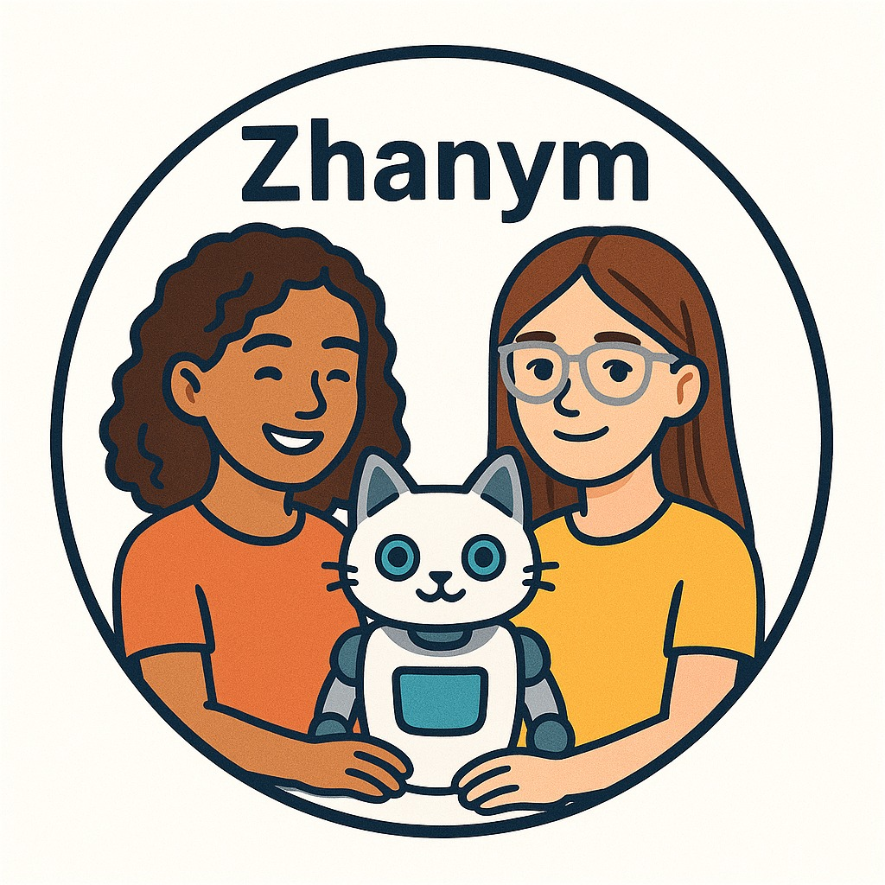
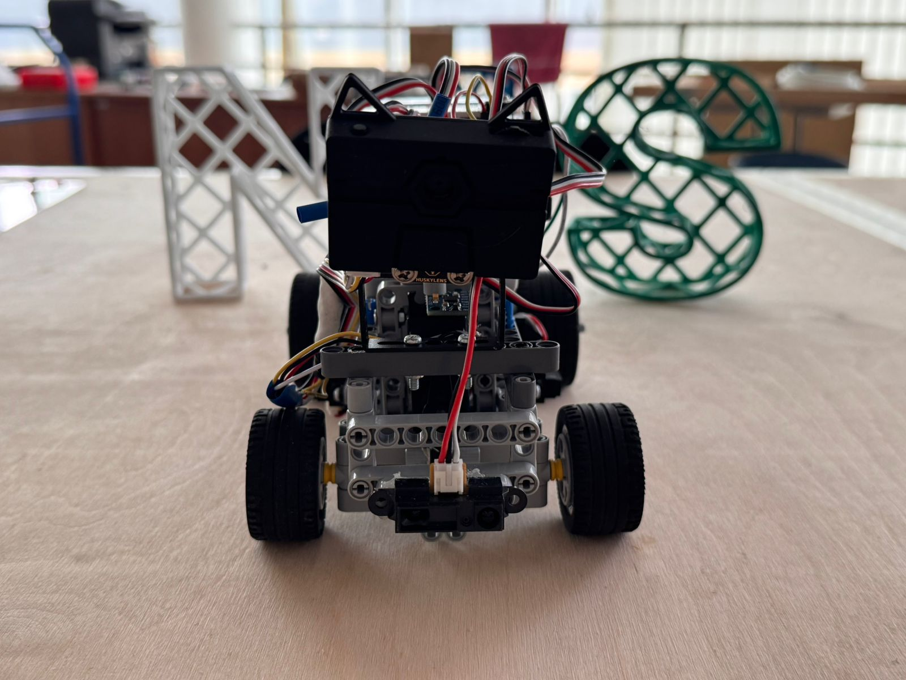
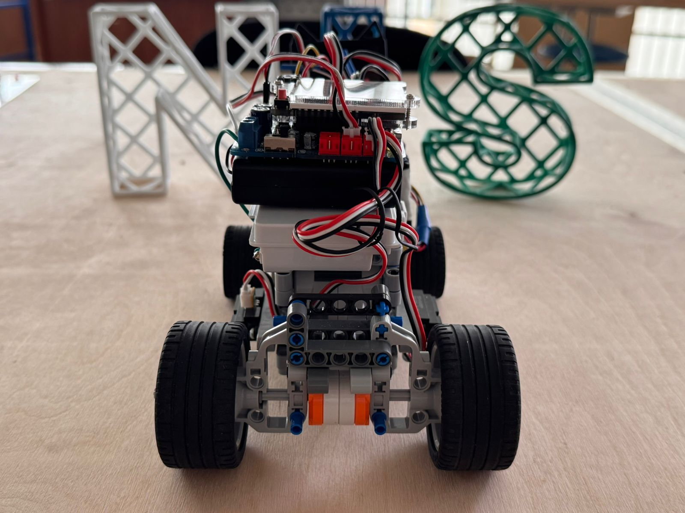
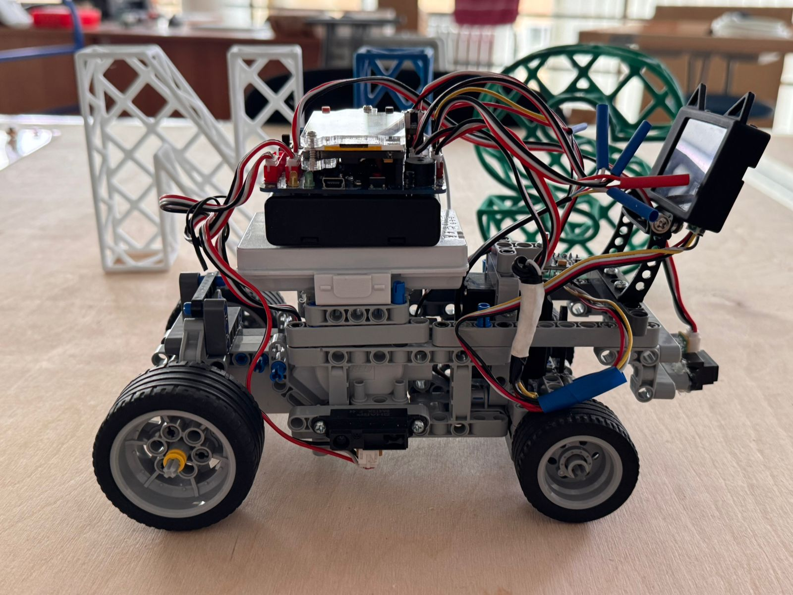
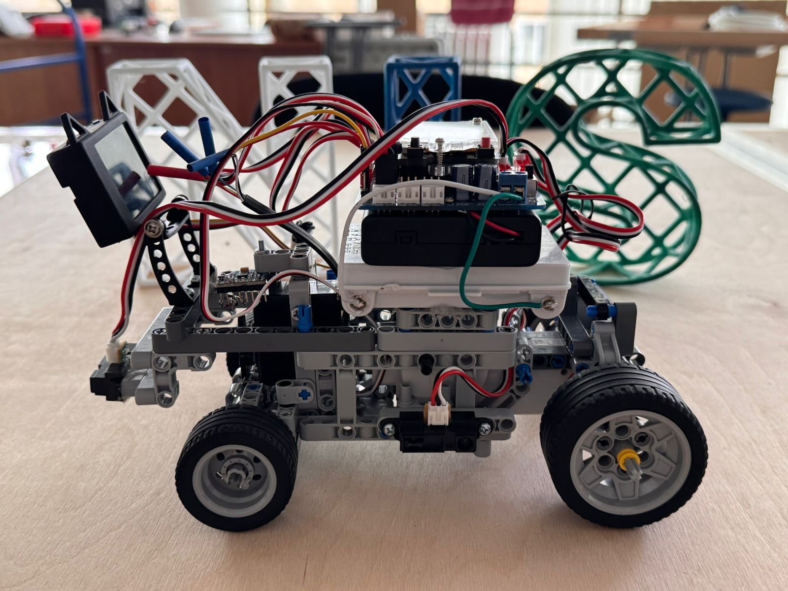
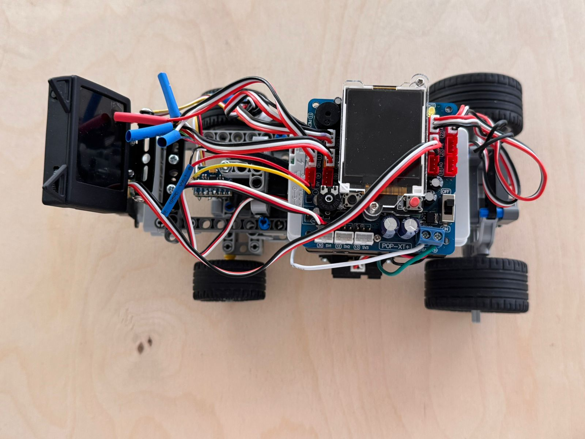
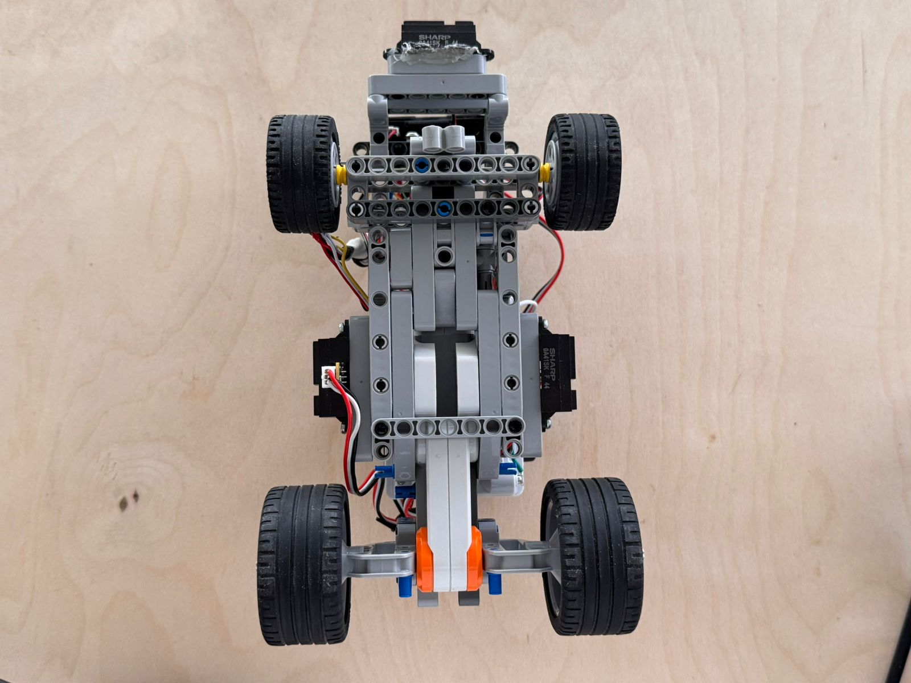
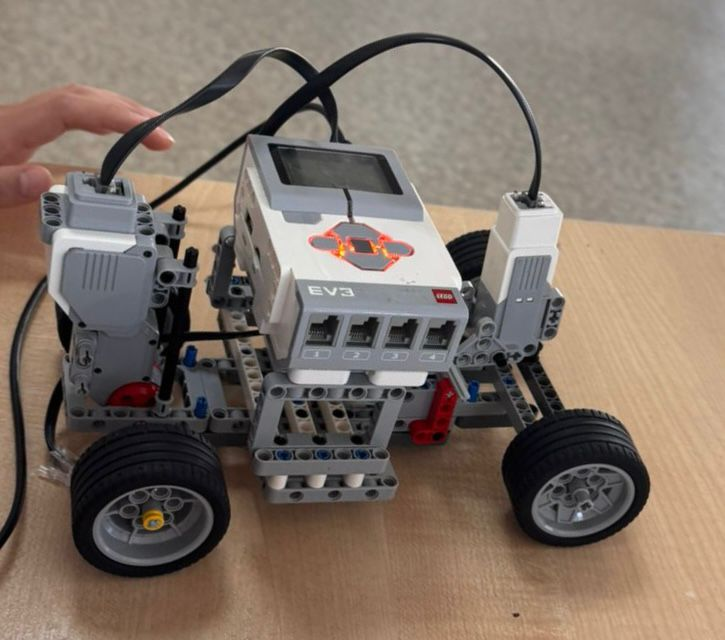
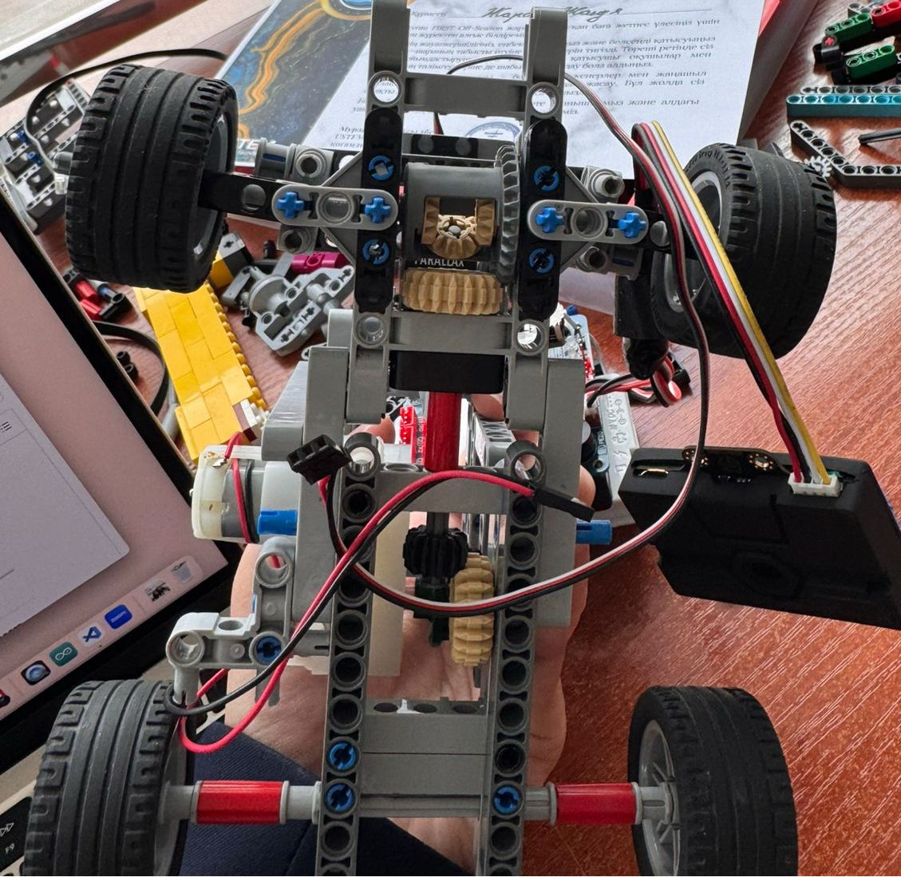
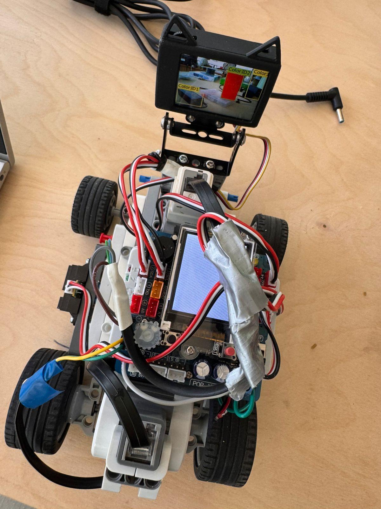

# <h1 align="center"> ZHANYM </h1> 

This repository showcases the journey and development of our robot created for the **2025 World Robot Olympiad – Future Engineers** category.

We are **Team Zhanym WRO2025**, a duo of passionate and driven girls who designed, engineered, and built this robot from the ground up.

Here, you'll find all the documentation, design insights, and technical details behind our project.

  

## Team Members 
### Khanbay Aigerim
Hello! 👋

My name is **Aigerim**, and I am **17 years old**.

This is my **second adventure** in the **WRO (World Robot Olympiad)** — a journey that fuels my passion for innovation and technology.

My first experience was back in **Grade 9**, when I took on the challenge of the **RoboMission category (Senior Division)**.  
That experience sparked my love for robotics and teamwork.

Now, I'm excited to take things to the next level as I dive into the **Future Engineers** category — where creativity, design, and real-world engineering come together! 🚀
.

### Zharas Zhanuya
Hi! 👋

I’m **Zhanuya**, a **16-year-old student** passionate about **engineering**, **coding**, and **hands-on problem solving**.

I love working on tech projects that combine **hardware and creativity**.

Last year, I competed in the **WRO Future Engineers** category,  
and I’m excited to keep learning and building in this category! 🚀

### 👨‍🏫 Mentor: Mister Askar
Hello! My name is **Askar**, and I am the **mentor** of this amazing team.

I’m truly happy to work with such talented and motivated students who are passionate about engineering, creativity, and robotics.

Guiding them through challenges and helping them grow is a privilege and a joy.

I also work at **Nazarbayev Intellectual School (NIS)** in **Atyrau**, where I support young minds in exploring STEM fields and developing real-world problem-solving skills.

---

## Autonomous Robotic Vehicle

This autonomous robotic vehicle is capable of self-driving on a dynamically changing racetrack, completing multiple laps without human input and adapting to new configurations in each round.

  <table style="background-color: #f0f0f0; text-align: center; border-collapse: collapse; font-family: Arial, sans-serif; transform: scale(1.2);">
    <tr>
      <td style="padding: 20px;">
         <strong>Front</strong>
      </td>
      <td style="padding: 20px;">
         <strong>Back</strong>
      </td>
    </tr>
    <tr>
      <td style="padding: 20px;">
         <strong>Right</strong>
      </td>
      <td style="padding: 20px;">
         <strong>Left</strong>
      </td>
    </tr>
    <tr>
      <td style="padding: 20px;">
         <strong>Top</strong>
      </td>
      <td style="padding: 20px;">
         <strong>Bottom</strong>
      </td>
    </tr>
  </table>

## Engineering Documentation Overview

This documentation outlines the key components of the engineering process involved in the development and operation of the autonomous vehicle. It provides an overview of the following subsystems:

### Mobility Control
Design and implementation of systems responsible for the vehicle's movement, including speed regulation, turning mechanisms, and path-following algorithms.

### Power and Sensory Management
Integration and management of the vehicle’s power supply, along with configuration and usage of various sensors. These sensors deliver essential environmental data used by the robot’s decision-making systems.

### Obstacle Navigation and Avoidance
Development of strategies and systems that allow the vehicle to detect, assess, and navigate around obstacles. This includes both hardware and software components required for safe and effective performance in the Obstacle Challenge.

# Mobility Control
## ⚙️ Mobility Control

### Evolution of Design

Over the course of development, we built and tested **three different chassis and drive configurations** to find the most reliable and competition-ready setup.

#### 🔧 First Version: EV3-Based Rear-Wheel Drive  
- **Motors**: Large EV3 motor for rear-wheel drive, Medium EV3 motor for steering  
- **Platform**: Open-source Linux-based EV3 firmware  
- **Pros**: Familiar platform, easy sensor integration  
- **Cons**: Long upload times, significant turning inaccuracies due to software delays and large motor inertia

  

#### 🔧 Second Version: Front-Wheel Drive with DC Gearbox Motors  
- **Motors**: Two front-mounted DC gearbox motors + front servo for steering  
- **Platform**: POP-BOT XT board with direct wiring  
- **Pros**: Improved maneuverability  
- **Cons**: Required a lot of internal space for motor connections; turning errors due to all movement being concentrated in the front wheels
  

  

🔧 **Third Version: Rear-Wheel Drive with EV3 Medium Motor for Steering**  
**Motors**: NXT motor for rear-wheel drive, Medium EV3 motor for steering  
**Drive Configuration**: Rear-wheel drive  
**Platform**: POP-BOT XT board  

**Pros**: Compact rear-wheel drive setup, stable at higher speeds  
**Cons**: Steering lacked precision since it was controlled by power level instead of angle, which led to inaccurate turns and difficulty in fine adjustments  
 

  

#### ✅ Final Version: Rear-Wheel Drive with NXT Motor and Parallax Servo  
- **Motors**: NXT motor for drive, Parallax continuous rotation servo for steering  
- **Drive Configuration**: Rear-wheel drive  
- **Improvements**:  
- **Rear-wheel drive** offers better traction and improved directional stability, especially at higher speeds  
- The **Parallax servo** enables precise angular steering, making turns smoother and more accurate
   

  

  
---

### 🔩 Drivetrain & Motors

- **Drive Motor**: LEGO NXT motor  
- **Mounting**: Connected through a custom holder to the rear axle  
- **Motor Driver**: Integrated with POP-BOT XT board  
- **Steering Mechanism**: Parallax continuous rotation servo motor connected via 3D-printed linkage system  

---

### 🔧 Potential Improvements

- Upgrade NXT motor to a lighter high-efficiency DC motor to reduce weight and increase speed control  
- Implement position feedback from servo for dynamic steering correction  
- Add soft damping or suspension to reduce shaking on uneven surfaces  

